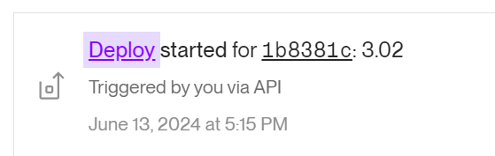

3.02

EXERCISE 3.2: A DEPLOYMENT PIPELINE TO A CLOUD SERVICE

my app code: https://github.com/liisaket/devops/tree/main/part1/1.15

### 1.16 CLOUD DEPLOYMENT
https://devops-tvy5.onrender.com/

### 3.02 ci/cd
my workflow file: https://github.com/liisaket/devops/blob/main/.github/workflows/deploy.yml

